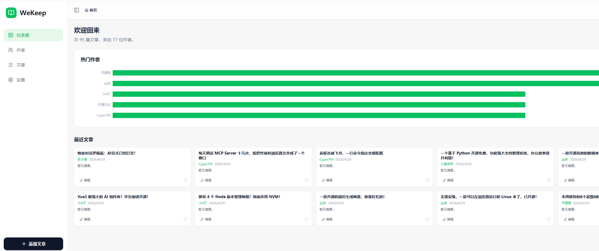
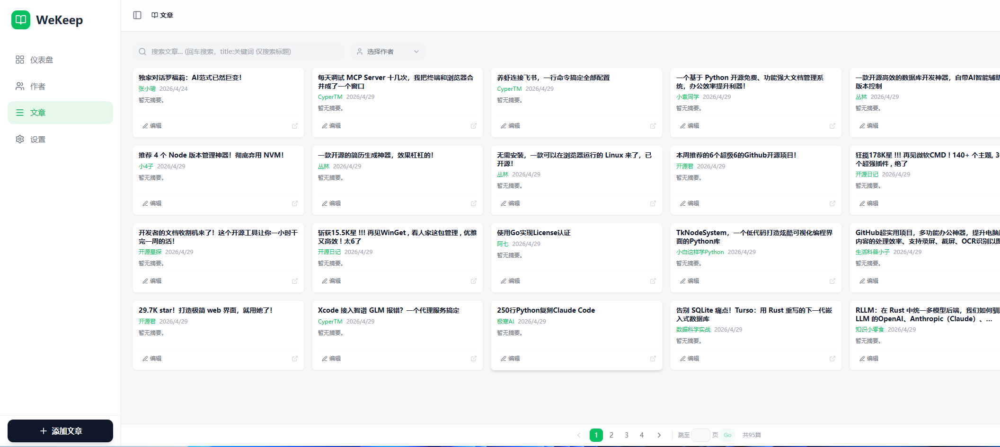
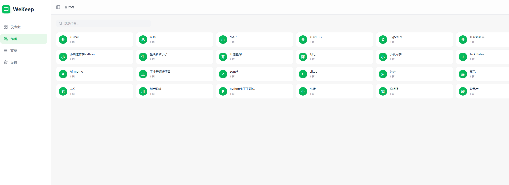
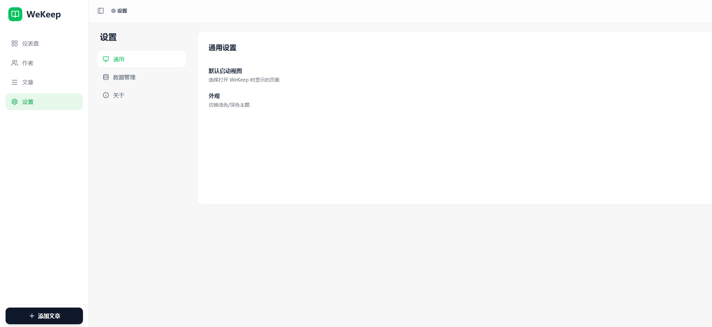

# WeKeep

[English](README.en.md) | 简体中文

> 微信公众号文章收藏管理工具 — 一键收藏、全文搜索、图片本地化、AI 驱动。

[](https://ghcr.io/cicbyte/wekeep)
[](https://github.com/cicbyte/weread-web/actions)
[](https://github.com/cicbyte/weread-web/releases/latest)
[](https://go.dev/)
[](LICENSE)

   

## 功能特性

- **文章收藏** — 抓取微信公众号文章，提取标题/作者/正文/图片，转换为 Markdown
- **全文搜索** — 基于 Meilisearch 的全文检索，支持标题、作者、摘要、内容搜索
- **图片本地化** — 自动下载文章图片到本地 / S3 存储，支持存储后端切换
- **AI 集成** — 内置 MCP Server，Claude / Cursor 等客户端可直接操作文章
- **分类与标签** — 灵活的分类管理和标签体系
- **作者管理** — 自动提取作者信息，按作者浏览文章
- **零配置启动** — 首次运行自动生成默认配置，默认 SQLite，开箱即用

## 技术栈

| 层级 | 技术 |
|------|------|
| 后端 | Go 1.24 / GoFrame v2.10.0 / MySQL / SQLite |
| 前端 | React 19 / TypeScript 5.8 / Vite 6.2 / Tailwind CSS |
| 搜索 | Meilisearch（可选） |
| 存储 | 本地文件系统 / S3 兼容（RustFS） |
| AI | MCP Server（AI 工具集成） |

## 快速开始

### 下载预编译二进制

从 [Releases](https://github.com/cicbyte/weread-web/releases) 下载对应平台的压缩包，解压后直接运行：

```bash
./wekeep
```

首次运行会自动生成 `manifest/config/config.yaml`，默认使用 SQLite，无需额外依赖。

### 从源码构建

**环境要求：** Go 1.24+、Node.js 22+

```bash
# 克隆项目
git clone https://github.com/cicbyte/weread-web.git
cd wekeep

# 构建前端
cd web && npm i && npm run build && cd ..
mkdir -p resource/public/html && cp -r web/dist/* resource/public/html/

# 运行
gf run
```

后端默认监听 `:8000`。

## 配置

首次运行自动生成 `manifest/config/config.yaml`，默认配置：

```yaml
server:
  address: ":8000"

database:
  default:
    link: "sqlite::@file(wekeep.db)"    # 默认 SQLite，零依赖

storage:
  type: "local"
  local:
    basePath: "uploads"

search:
  enabled: false                          # 需安装 Meilisearch 后开启
```

切换 MySQL 示例：

```yaml
database:
  default:
    link: "mysql:root:password@tcp(127.0.0.1:3306)/wekeep?charset=utf8mb4&parseTime=true&loc=Local"
```

完整配置模板见 [`manifest/config/config.yaml.example`](manifest/config/config.yaml.example)。

## Docker 部署

从 GHCR 拉取镜像：

```bash
docker pull ghcr.io/cicbyte/wekeep:latest

docker run -d -p 8000:8000 \
  -v ./manifest:/app/manifest \
  -v ./log:/app/log \
  -v ./uploads:/app/uploads \
  -v ./db:/app/db \
  ghcr.io/cicbyte/wekeep:latest
```

也可从源码构建镜像：

```bash
docker build -t wekeep .
```

挂载说明：

| 宿主机路径 | 容器路径 | 说明 |
|-----------|---------|------|
| `./manifest` | `/app/manifest` | 配置文件（首次运行自动生成 `config.yaml`） |
| `./log` | `/app/log` | 日志 |
| `./uploads` | `/app/uploads` | 上传文件 |
| `./db` | `/app/db` | SQLite 数据库文件 |

## MCP Server

WeKeep 内置 MCP Server，支持 Claude Desktop、Cursor 等 AI 客户端直接操作文章收藏。

**MCP 端点：** `http://localhost:8000/mcp`（StreamableHTTP）

**配置示例（Claude Desktop）：**

```json
{
  "mcpServers": {
    "wekeep": {
      "url": "http://localhost:8000/mcp"
    }
  }
}
```

**可用工具：**

| 工具名 | 说明 |
|--------|------|
| `wechat_parse_url` | 解析微信文章 URL，提取标题/作者/正文 |
| `wechat_save_article` | 保存文章到收藏 |
| `wechat_list_articles` | 列出文章列表（支持分页） |
| `wechat_get_article` | 获取单篇文章详情 |
| `wechat_search_articles` | 全文搜索文章 |
| `wechat_get_tags` | 获取所有标签 |
| `wechat_get_stats` | 获取文章统计数据 |
| `wechat_delete_article` | 删除文章 |

## 项目结构

```
wekeep/
├── api/v1/                  # API 请求/响应定义（g.Meta 路由标签）
├── internal/
│   ├── controller/          # HTTP 控制器
│   ├── service/             # Service 接口定义
│   ├── logic/               # 业务逻辑实现（init() 自动注册）
│   ├── dao/                 # 数据访问层（自动生成，勿手动编辑）
│   ├── model/               # 数据模型（entity/do/info）
│   ├── parser/              # 微信文章 HTML 解析器
│   ├── storage/             # 存储抽象层（Local / S3）
│   ├── mcp/                 # MCP Server（StreamableHTTP）
│   └── router/              # 路由注册
├── library/
│   ├── libMeilisearch/      # Meilisearch 客户端封装
│   └── libRouter/           # 路由自动绑定
├── web/                     # React 前端
├── resource/
│   ├── public/html/         # 前端构建产物（打包进二进制）
│   └── sql/                 # 数据库初始化脚本（打包进二进制）
├── scripts/                 # 构建/发布脚本
├── manifest/config/         # 配置文件
├── Dockerfile               # 多阶段构建
└── .github/workflows/       # CI/CD
```

## API

| 模块 | 路径 | 说明 |
|------|------|------|
| 文章 | `/api/v1/articles` | CRUD、搜索、Gemini 解析 |
| 分类 | `/api/v1/categories` | 分类管理 |
| 作者 | `/api/v1/authors` | 作者管理 |
| 图片 | `/api/v1/images` | 图片管理、文件代理 |
| 搜索 | `/api/v1/search/*` | 全文搜索 |
| 存储 | `/api/v1/storage/*` | 存储后端管理 |
| MCP | `/mcp/*` | MCP Server（StreamableHTTP） |
| 系统 | `/api/v1/health/*` | 健康检查、版本信息 |

## License

[MIT](LICENSE)
