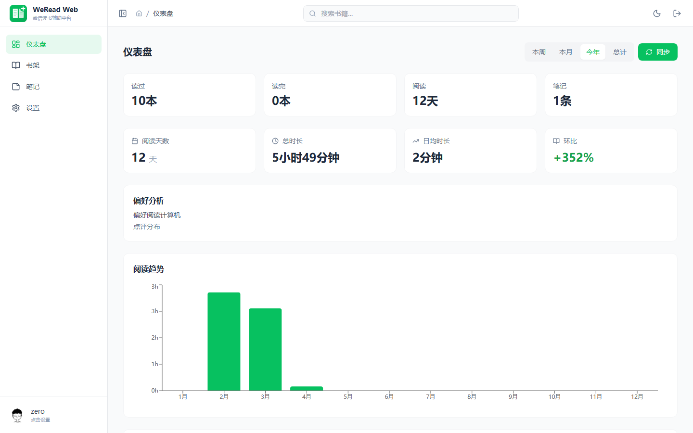
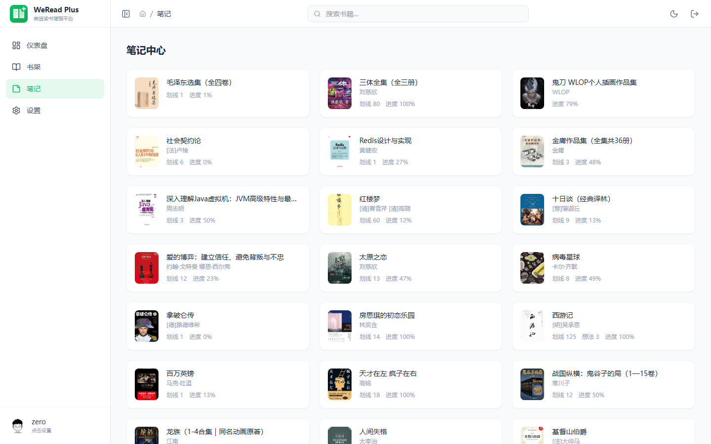
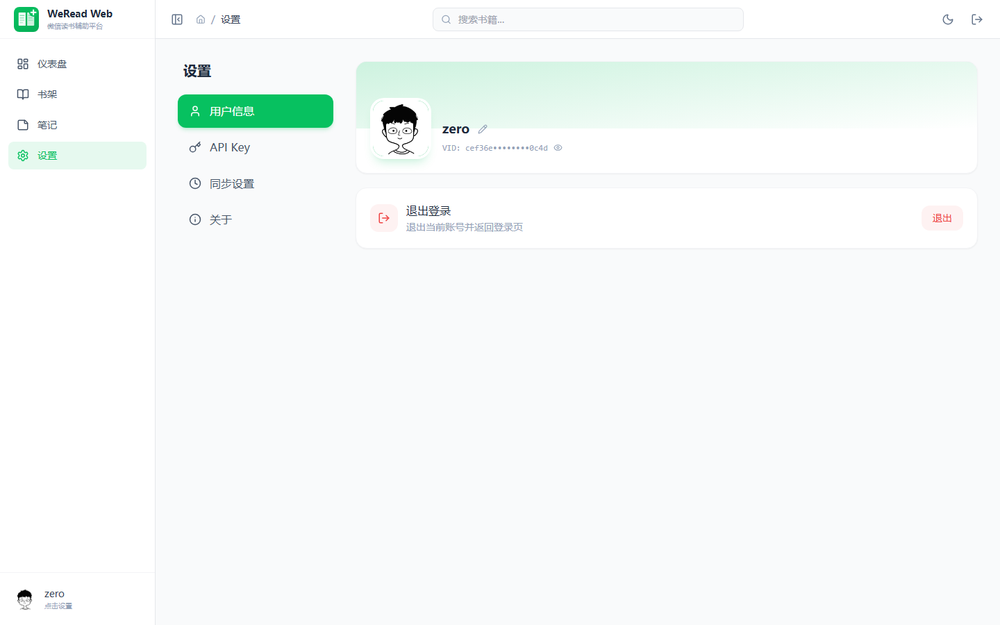
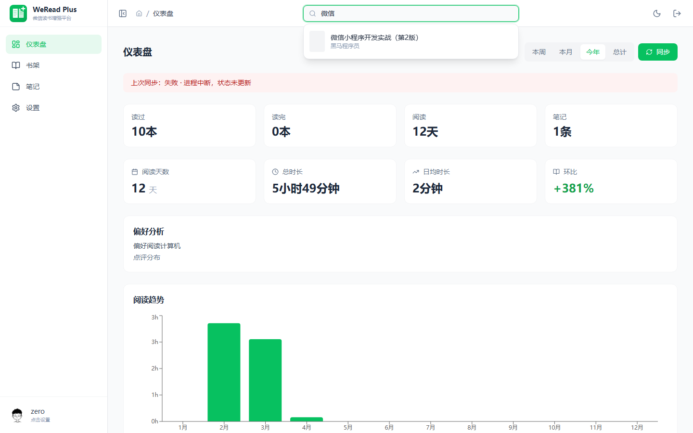
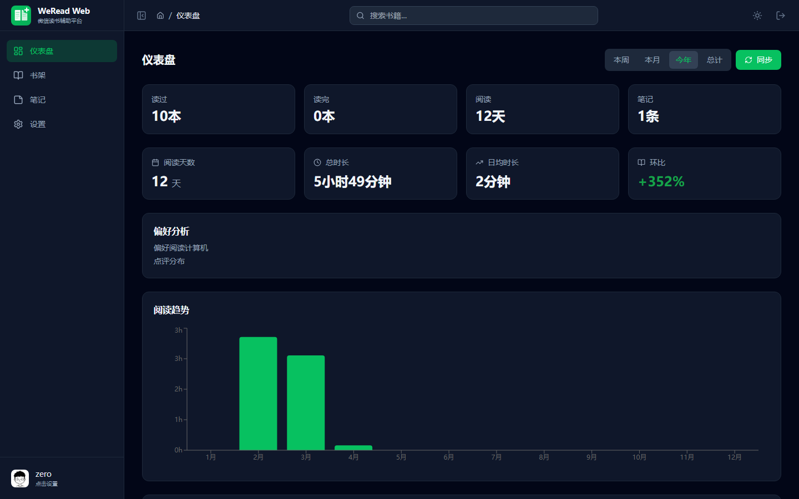

# WeRead Web

[简体中文](README.md) | [English](README.en.md)

> 微信读书辅助平台 — 书架管理、阅读统计、笔记导出、智能搜索，一站式管理你的微信读书数据。

## 预览

<table>
  <tr>
    <td align="center"><b>仪表盘</b></td>
    <td align="center"><b>书架</b></td>
  </tr>
  <tr>
    <td></td>
    <td></td>
  </tr>
  <tr>
    <td align="center"><b>笔记中心</b></td>
    <td align="center"><b>设置</b></td>
  </tr>
  <tr>
    <td></td>
    <td></td>
  </tr>
  <tr>
    <td align="center"><b>全局搜索</b></td>
    <td align="center"><b>深色模式</b></td>
  </tr>
  <tr>
    <td></td>
    <td></td>
  </tr>
</table>

## 功能特性

- **书架管理** — 同步微信读书书架，支持全部/在读/读完/推荐筛选
- **增量同步** — 基于 `readUpdateTime` 变更检测，只同步有变化的书籍笔记，自动清理已删除数据
- **全局搜索** — 顶部搜索框实时搜索微信读书书城，下拉即达
- **阅读统计** — 仪表盘展示阅读天数、时长、趋势图、分类偏好、读书排行，支持周/月/年/总计切换
- **笔记中心** — 浏览所有笔记本，查看划线和想法，支持序号显示
- **书籍详情** — 查看目录、笔记、点评，支持 Markdown/HTML/TXT/PDF 多格式导出
- **图片缓存** — 书籍封面本地缓存代理，首次下载后从本地返回，30 天 HTTP 缓存
- **深色模式** — 完整的深色模式支持，跟随系统或手动切换
- **响应式布局** — 可收缩侧边栏，移动端适配，面包屑导航
- **定时同步** — 可配置自动同步频率（每小时/6h/12h/每日/每周），Cron 调度器

## 技术栈

| 层级 | 技术 |
|------|------|
| 后端 | Go 1.24 / GoFrame v2.10.0 / SQLite / MySQL |
| 前端 | React 19 / TypeScript 5.8 / Vite 6.2 / Tailwind CSS / Recharts |
| 图标 | Lucide React |
| 存储 | 本地文件系统 / S3 兼容（RustFS） |

## 快速开始

### 从源码运行

**环境要求：** Go 1.24+、Node.js 22+

```bash
# 克隆项目
git clone https://github.com/cicbyte/weread-web.git
cd weread-web

# 构建前端
cd web && npm i && npm run build && cd ..
mkdir -p resource/public/html && cp -r web/dist/* resource/public/html/

# 运行（首次启动自动创建 SQLite 数据库）
go run main.go
```

启动后访问 `http://localhost:8793`，默认使用 SQLite（数据存储在 `data/db/weread_web.db`），无需额外配置数据库。

### 前端开发

```bash
cd web
npm run dev    # 开发服务器（端口 8898）
npm run build  # 构建到 web/dist/
```

构建产物需复制到 `resource/public/html/` 供 Go 后端托管。

### 使用 MySQL

编辑 `manifest/config/config.yaml`，将数据库链接改为 MySQL：

```yaml
database:
  default:
    link: "mysql:root:123456@tcp(127.0.0.1:3306)/weread_web?charset=utf8mb4&parseTime=true&loc=Local"
```

首次启动自动建表。

## 登录

首次使用需要输入微信读书 Skill API Key（通过 WeRead Skill 获取），登录后 Token 存储在本地。

## 页面说明

| 页面 | 路由 | 说明 |
|------|------|------|
| 仪表盘 | `/` | 阅读统计总览：摘要卡片、核心指标、趋势图、分类偏好、读书排行、阅读标签 |
| 书架 | `/bookshelf` | 书架管理 + 推荐，支持筛选（全部/在读/读完/推荐） |
| 笔记 | `/notes` | 笔记本列表 → 划线和想法浏览 |
| 书籍详情 | `/book/:bookId` | 目录、笔记、点评、多格式导出 |
| 设置 | `/settings` | 用户资料、API Key 管理、同步配置、关于 |

## 项目结构

```
weread-web/
├── api/v1/                  # API 请求/响应定义（g.Meta 路由标签）
├── internal/
│   ├── cmd/                 # 启动入口、自动迁移、约束补齐
│   ├── controller/          # HTTP 控制器
│   ├── service/             # Service 接口定义
│   ├── logic/               # 业务逻辑实现（init() 自动注册）
│   │   ├── auth/            # 认证：JWT、API Key 管理
│   │   ├── sync/            # 同步：书架/笔记/进度/统计（增量）
│   │   ├── weread/          # 微信读书 API 代理
│   │   └── proxy/           # 图片缓存代理
│   ├── dao/                 # 数据访问层（自动生成，勿手动编辑）
│   ├── model/               # 数据模型（entity/do/info）
│   ├── router/              # 路由注册
│   ├── cron/                # 定时任务调度器
│   ├── mcp/                 # MCP Server（StreamableHTTP）
│   └── storage/             # 存储抽象层（Local / S3）
├── web/                     # React 前端
│   ├── components/          # 布局、Toast 等公共组件
│   ├── pages/               # 页面组件
│   └── services/            # API 调用服务
├── resource/
│   ├── public/html/         # 前端构建产物（打包进二进制）
│   └── sql/                 # 数据库初始化脚本（MySQL / SQLite）
├── scripts/                 # 截图等工具脚本
├── manifest/config/         # 配置文件
└── Dockerfile               # 多阶段构建
```

## API

| 模块 | 路径 | 说明 |
|------|------|------|
| 认证 | `/api/v1/auth/*` | 登录、刷新 Token、API Key 管理、用户资料 |
| 微信读书代理 | `/api/v1/weread/proxy` | 代理转发微信读书 API |
| 图片代理 | `/api/v1/image/proxy` | 书籍封面缓存代理 |
| 笔记导出 | `/api/v1/notes/export` | Markdown/HTML/TXT/PDF 导出 |
| 数据同步 | `/api/v1/sync/*` | 书架、笔记、进度、统计同步（增量） |
| 系统 | `/api/v1/health` | 健康检查（含版本号、运行时间） |
| MCP | `/mcp/*` | AI 工具集成（StreamableHTTP） |

## 数据同步策略

| 维度 | 说明 |
|------|------|
| 书架 | Upsert（`vid + book_id`），同步后清理已移除的书 |
| 笔记 | 基于 `readUpdateTime` 变更检测，只拉取有变化的书的笔记，Upsert + 清理已删除笔记 |
| 进度 | Upsert（`vid + book_id`），同步后清理已移除的书的进度 |
| 统计 | Delete + Insert（仅 4 行数据） |
| 触发 | 手动触发 / 定时 Cron（可配置频率） |

## Docker 部署

```bash
docker build -t weread-web .

docker run -d -p 8793:8793 \
  -v ./manifest:/app/manifest \
  -v ./data:/app/data \
  weread-web
```

## License

[MIT](LICENSE)
